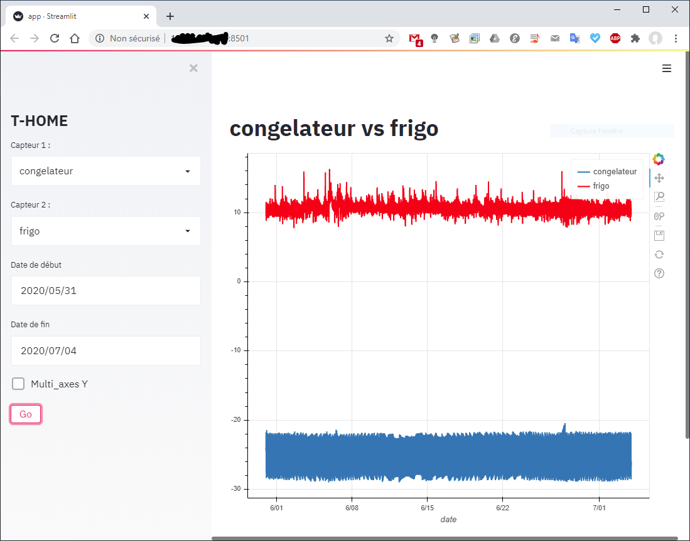

Une application web pour extraire les données de TempeDB (a mysql database)

# avec Streamlit

https://www.streamlit.io/

# Installation sur raspian

## Des paquets qui peuvent manquer

* sudo apt-get install libatlas-base-dev
* sudo apt-get install libopenjp2-7
* sudo apt-get install libtiff5

## Installation des lib python
sudo pip3 install -r requirements.txt

## Installation du service

sudo systemd enable t_home.service

# Utilisation

http://ip_du_serveur:8501

